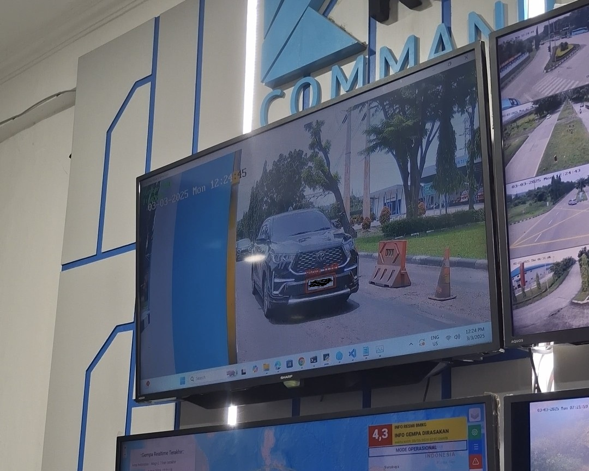
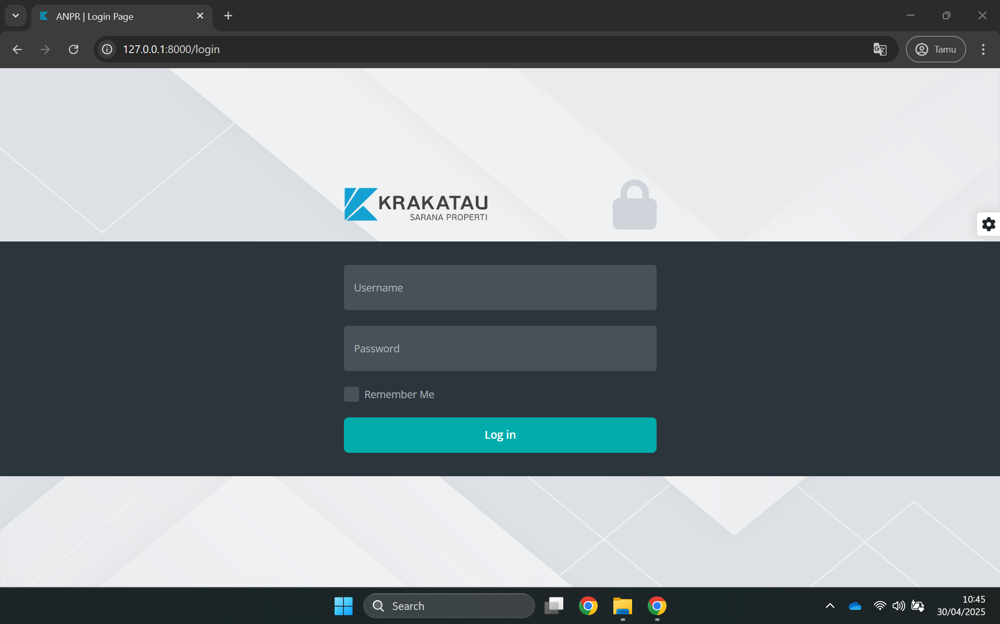
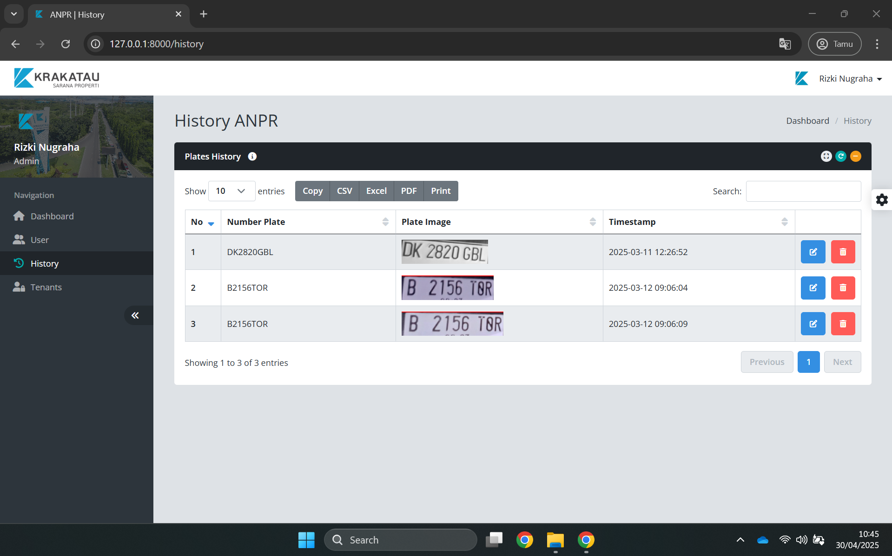
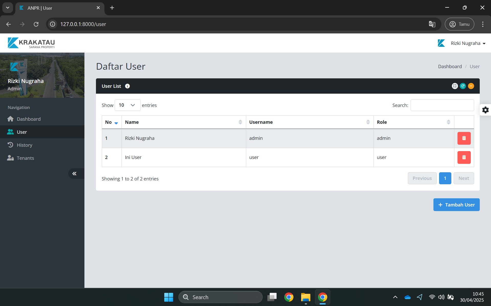

# 🚗 Automatic Number Plate Recognition (ANPR) System 🔍

## 📋 Project Overview
This Automatic Number Plate Recognition (ANPR) system is an ongoing development project at PT. Krakatau Sarana Properti. The system is designed to enhance gate security and vehicle management by automatically identifying and logging vehicles entering company premises through their license plates.

The ANPR solution integrates with existing CCTV infrastructure at the company's gates to capture vehicle images in real-time. Using advanced computer vision and machine learning techniques, the system detects license plates, extracts their contents using Optical Character Recognition (OCR), and stores this information in a database. The entire process is automated, reducing manual entry errors and improving security monitoring efficiency. If there is an error in the system, the admin can edit the result, so that it is relevant to the detected plate image.

## ✨ Key Features
- **Real-time License Plate Detection**: Direct integration with gate CCTV systems
- **Machine Learning Based Recognition**: Custom-trained ML model for Indonesian license plates
- **Optical Character Recognition (OCR)**: Automated extraction of alphanumeric plate data
- **Web Dashboard**: User-friendly interface for security personnel
- **User Management**: Role-based access control for system administrators
- **Historical Data Analysis**: Review and search past vehicle movements
- **API Architecture**: Robust backend for system integration
- **Security Optimized**: Designed for company gate security applications

## 🔄 System Workflow
1. **Image Acquisition**: CCTV cameras capture vehicle images at entry/exit points
2. **License Plate Detection**: Machine learning model identifies the license plate region
3. **Image Processing**: The detected plate is isolated and enhanced for better recognition
4. **OCR Processing**: Text on the license plate is extracted using OCR
5. **Data Validation**: The extracted text is validated for accuracy
6. **Database Storage**: Valid license plate data is stored with timestamp and location
7. **Dashboard Update**: The web interface displays the latest entry/exit information

## 🖼️ Preview

### Detection Results

### System Login

### Reading History

### User Management

## 🛠️ Technologies

### Computer Vision & ML 🧠
- **YOLOv8**: For license plate detection in images
- **Roboflow**: Platform for dataset management and model training
- **OpenCV**: Image processing and enhancement
- **OCR**: Still looking for a suitable OCR
- **Custom Dataset**: 819 CCTV images of Indonesian license plates, and will continue to improve

### Backend Development 🔧
- **Laravel PHP Framework**: API and web application development
- **RESTful API Architecture**: For communication between detection system and database
- **MySQL Database**: Structured storage of vehicle and user data
- **Authentication System**: Secure access control

### Frontend Development 💻
- **Blade Templates**: Laravel's templating engine
- **Dashboard Template**: Responsive UI design
- **JavaScript/jQuery**: Dynamic interface elements
- **ChartJS**: Data visualization for analytics (planned)

## 📊 Current Development Status
This project is actively under development at PT. Krakatau Sarana Properti. The current progress includes:

- ✅ CCTV integration with processing system
- ✅ Initial machine learning model trained on 819 license plate images
- ✅ Basic license plate detection functionality
- ✅ OCR integration for text extraction
- ✅ API development for database storage
- ✅ Web dashboard initial version
- ✅ User authentication system
- 🔄 Improving detection accuracy
- 🔄 Enhancing OCR reliability for Indonesian plates
- 🔄 Expanding the training dataset
- 🔄 Optimizing system for real-time performance

## 🚀 Future Improvements
- **Enhanced Recognition Accuracy**: Further model training with larger datasets
- **Night-time Detection Optimization**: Improve performance in low-light conditions
- **Vehicle Type Classification**: Additional ML model to classify vehicle types
- **Mobile Application**: Companion app for security personnel
- **Notification System**: Automated alerts for unauthorized vehicles
- **Analytics Dashboard**: Advanced statistics on vehicle movement patterns
- **Integration with Barrier Systems**: Automatic gate control for authorized vehicles
- **Multi-location Support**: Scaling to multiple entry/exit points

## 🔒 Security Considerations
- All access to the system is protected through role-based authentication
- Vehicle data is stored securely in compliance with company privacy policies
- The system is deployed on isolated network infrastructure
- Regular security audits ensure data protection
- License plate information is considered sensitive data and handled accordingly

## 🤝 Project Team
This project is being developed through internship collaboration at PT. Krakatau Sarana Properti, combining expertise in:
- Computer Vision and Machine Learning
- Web Development and API Design
- Database Management
- Security Systems Integration

---

*This README represents an ongoing project and will be updated as development progresses.*
