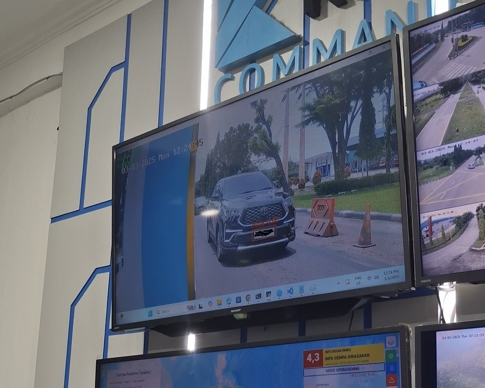
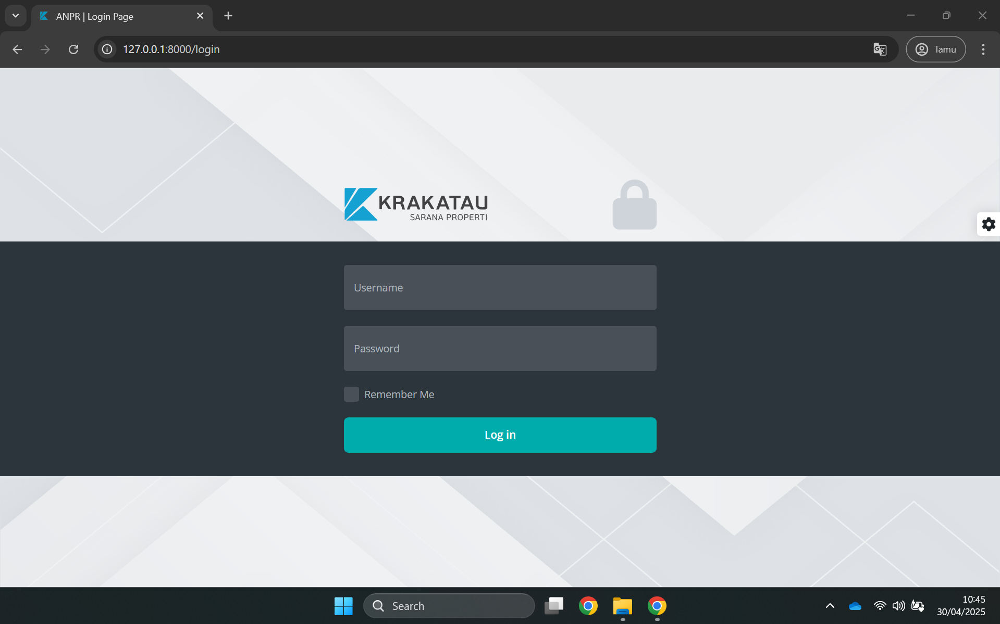
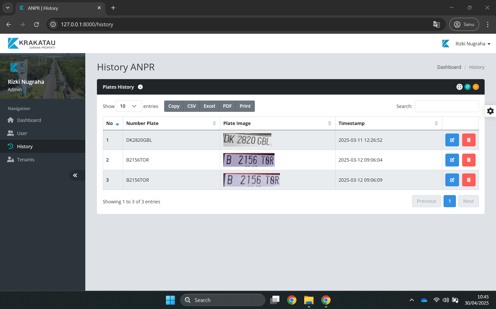
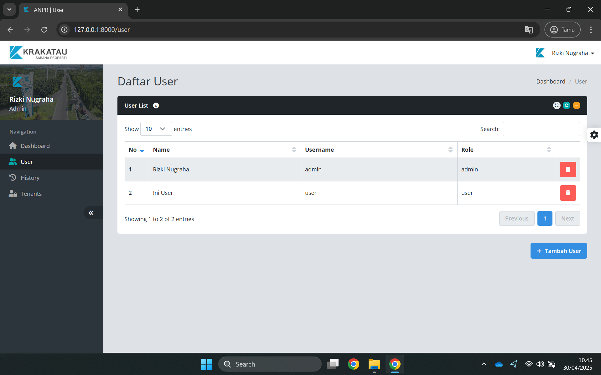

# 🚗 Automatic Number Plate Recognition (ANPR) System 🔍

## 📋 Project Overview
This Automatic Number Plate Recognition (ANPR) system was developed during an internship at **PT. Krakatau Sarana Properti** to support gate security and vehicle monitoring. The system automatically detects and identifies vehicles entering and exiting company premises through their license plates using existing CCTV infrastructure.

The system combines **computer vision, machine learning, Optical Character Recognition (OCR), IoT integration, RESTful APIs, and a web-based dashboard** to automate the vehicle identification process. CCTV frames are processed in real time to detect vehicles, identify license plates, extract plate numbers, and record the results in a centralized database.

The system also provides a dashboard for security personnel to monitor vehicle activity and review historical detection records. When the OCR result does not accurately represent the detected license plate, authorized administrators can manually edit the result while retaining the corresponding plate image as a reference.

## ✨ Key Features
- **Real-time Vehicle Detection** — Processes CCTV streams and detects vehicles within a predefined Region of Interest (ROI)
- **License Plate Detection** — Detects Indonesian vehicle license plates using a custom-trained YOLO model
- **Vehicle Type Classification** — Classifies detected vehicles into car, truck, and bus categories
- **Optical Character Recognition (OCR)** — Extracts alphanumeric characters from detected license plates
- **Image Processing** — Crops and enhances license plate images to improve OCR recognition
- **Vehicle Tracking** — Tracks detected vehicles to support consistent detection and prevent unnecessary duplicate processing
- **Web Dashboard** — Displays vehicle detection statistics and historical records
- **Vehicle History** — Stores and provides access to previous vehicle detection records
- **Tenant Verification** — Checks detected license plates against registered tenant data
- **Manual Data Correction** — Allows authorized users to correct OCR results when necessary
- **RESTful API** — Provides communication between the detection system and the backend
- **Role-Based Authentication** — Restricts system functionality based on user roles
- **CCTV Integration** — Integrates directly with the existing CCTV infrastructure

## 🔄 System Workflow
1. **Image Acquisition**: CCTV cameras capture vehicle images at entry/exit points
2. **License Plate Detection**: Machine learning model identifies the license plate region
3. **Image Processing**: The detected plate is isolated and enhanced for better recognition
4. **OCR Processing**: Text on the license plate is extracted using OCR
5. **Data Validation**: The extracted text is validated for accuracy
6. **Database Storage**: Valid license plate data is stored with timestamp and location
7. **Dashboard Update**: The web interface displays the latest entry/exit information

## 🧠 Computer Vision & Machine Learning

The computer vision pipeline was developed to process CCTV frames and identify vehicles and their license plates.

### Vehicle Detection & Classification

- **YOLOv11** — Custom-trained model for vehicle detection and classification
- **Roboflow** — Dataset management, annotation, versioning, and model training
- **Supervision** — Object detection visualization, tracking, and ROI processing
- **OpenCV** — Image processing and frame manipulation
- **Custom Dataset** — Dataset collected from CCTV footage at the research location

The model was trained to classify vehicles into:

- 🚗 Car
- 🚚 Truck
- 🚌 Bus

### License Plate Recognition

The license plate recognition pipeline consists of:

1. License plate detection
2. License plate image cropping
3. Image preprocessing and enhancement
4. OCR inference
5. OCR result cleaning and validation

The OCR processing utilizes **ONNX Runtime** and the `fast-plate-ocr` library for efficient license plate text recognition.

## 📊 Dataset

The model was trained using a custom dataset collected from CCTV footage and supplemented with additional images to improve vehicle classification performance.

### Dataset Distribution

| Dataset | Images | Percentage |
|---|---:|---:|
| Training | 1,621 | 80% |
| Validation | 206 | 10% |
| Testing | 199 | 10% |
| **Total** | **2,026** | **100%** |

### Vehicle Annotations

| Vehicle Class | Annotations |
|---|---:|
| Car | 1,321 |
| Truck | 644 |
| Bus | 217 |

The dataset was managed and versioned using **Roboflow** before being used for model training.

## 🧪 Model Performance

The completed system was evaluated under different environmental and operational conditions.

### Vehicle Classification

The vehicle classification model achieved an overall accuracy of approximately:

**96%**

The evaluation included:

- Precision
- Recall
- F1-score
- mAP@50
- Confusion matrix

### OCR Performance

The license plate OCR system achieved:

- **Average OCR confidence during daytime:** 92.38%
- **Average OCR confidence during nighttime:** 87.80%
- **Overall OCR reading accuracy:** approximately 92%

The system also applies image preprocessing, including license plate image enlargement, to improve OCR recognition.

## ⚡ System Performance

Performance testing was conducted to evaluate the response time and resource utilization of the completed system.

| Metric | Result |
|---|---:|
| Vehicle Classification Accuracy | 96% |
| Average OCR Confidence | 92.38% |
| OCR Reading Accuracy | 92% |
| API Response Time | 0.333 seconds |
| System Response Time | 0.545 seconds |
| CPU Utilization | 67.32% |
| Memory Usage | 530.56 MB |

These results indicate that the system is capable of processing vehicle detection and recognition within a practical response time for gate monitoring applications.

## 🔌 API Architecture

The detection system communicates with the Laravel backend through a RESTful API.

The API is responsible for:

- Receiving vehicle detection results
- Receiving license plate information
- Storing vehicle images
- Storing license plate images
- Recording detection timestamps
- Checking registered tenant information
- Managing vehicle detection records
- Providing data to the web dashboard

Example data transmitted by the detection system includes:

```json
{
    "vehicle_type": "Car",
    "number_plate": "B1234XYZ",
    "vehicle_image": "vehicle/image/path.jpg",
    "plate_image": "plate/image/path.jpg"
}
```

The backend validates and stores the detection data in the MySQL database.

## 🖼️ Preview

### Detection Results


### System Login


### Reading History


### User Management


## 🛠️ Technologies

### Computer Vision & ML 🧠
- **YOLOv11**: For license plate detection in images
- **Roboflow**: Platform for dataset management and model training
- **OpenCV**: Image processing and enhancement
- **OCR**: Fast Plate OCR

### Backend Development 🔧
- **Laravel PHP Framework**: API and web application development
- **RESTful API Architecture**: For communication between detection system and database
- **MySQL Database**: Structured storage of vehicle and user data
- **Authentication System**: Role based access control

### Frontend Development 💻
- **Blade Templates**: Laravel's templating engine
- **Dashboard Template**: Responsive UI design
- **JavaScript/jQuery**: Dynamic interface elements
- **ChartJS**: Data visualization for analytics

## 📈 Development Results
The completed project successfully integrates computer vision, machine learning, OCR, backend APIs, and a web dashboard into a single ANPR solution.

The final system is capable of:
- Detecting vehicles from CCTV streams
- Classifying vehicle types
- Detecting Indonesian license plates
- Extracting license plate numbers using OCR
- Tracking detected vehicles
- Recording vehicle detection data
- Checking vehicles against registered tenant data
- Displaying detection results through a web dashboard
- Reviewing historical vehicle movements
- Correcting inaccurate OCR results
- Communicating detection results through a RESTful API

## 🚀 Future Improvements
- **Enhanced Recognition Accuracy**: Further model training with larger datasets
- **Night-time Detection Optimization**: Improve performance in low-light conditions
- **Vehicle Type Classification**: Additional ML model to classify vehicle types
- **Mobile Application**: Companion app for security personnel
- **Notification System**: Automated alerts for unauthorized vehicles
- **Analytics Dashboard**: Advanced statistics on vehicle movement patterns
- **Integration with Barrier Systems**: Automatic gate control for authorized vehicles
- **Multi-location Support**: Scaling to multiple entry/exit points

## 🔒 Security Considerations
The system was designed with security and controlled access in mind.
- Role-based authentication is implemented for system users
- Administrative functions are restricted to authorized users
- Vehicle detection records are stored in a centralized database
- License plate images and vehicle images are associated with their corresponding detection records
- The system operates within the company's network infrastructure
- API communication is structured through controlled backend endpoints
- Manual correction of OCR results is restricted to authorized users
- Vehicle and license plate information is treated as sensitive operational data

## 🤝 Project Team
This project is being developed through internship collaboration at PT. Krakatau Sarana Properti, combining expertise in:
- Computer Vision and Machine Learning
- Web Development and API Design
- Database Management
- Security Systems Integration

---
